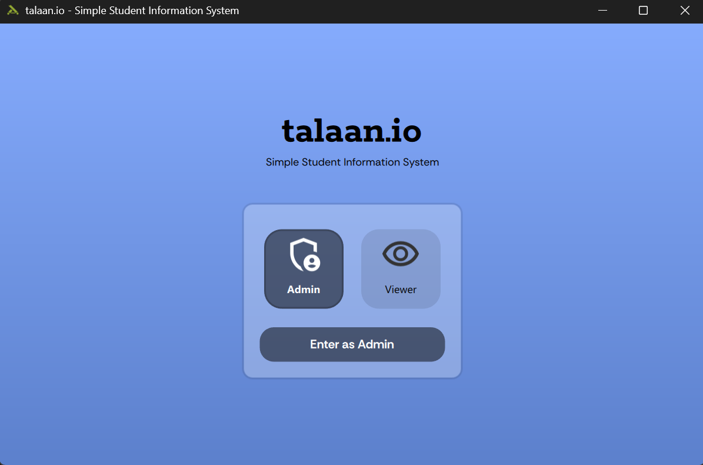
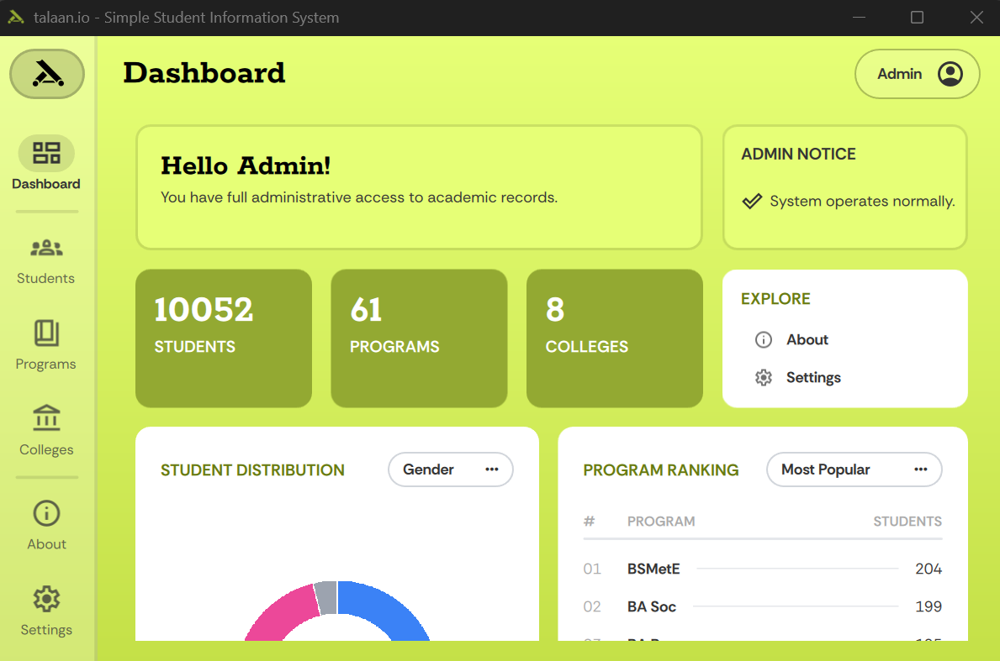
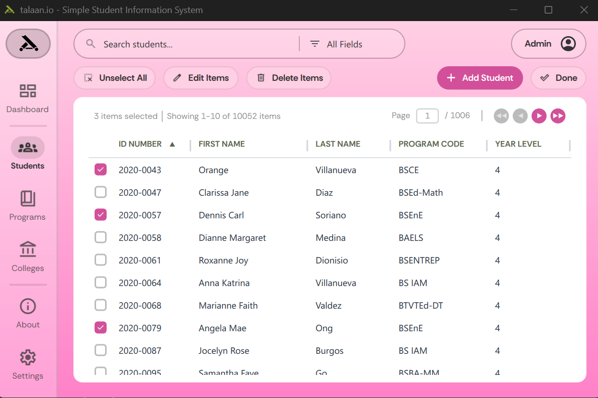
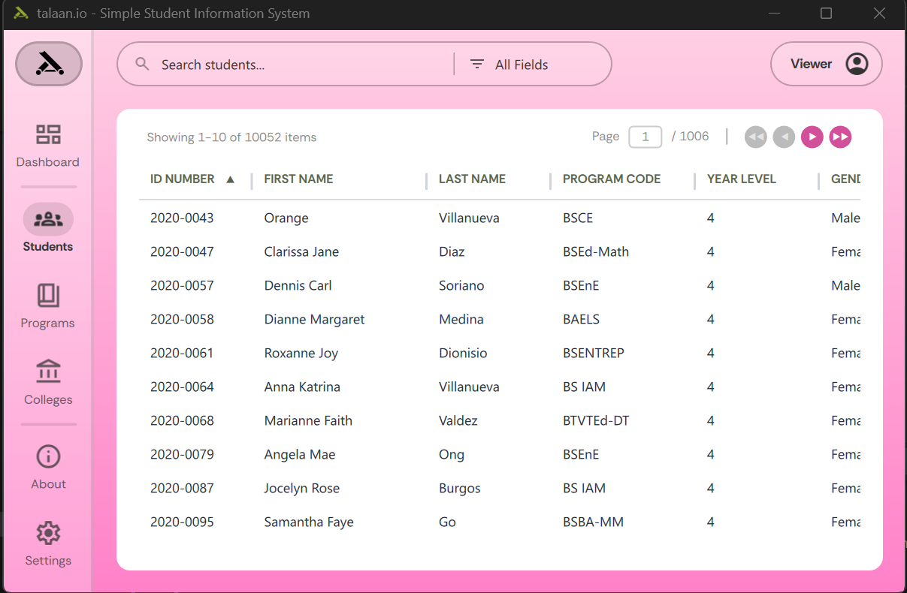
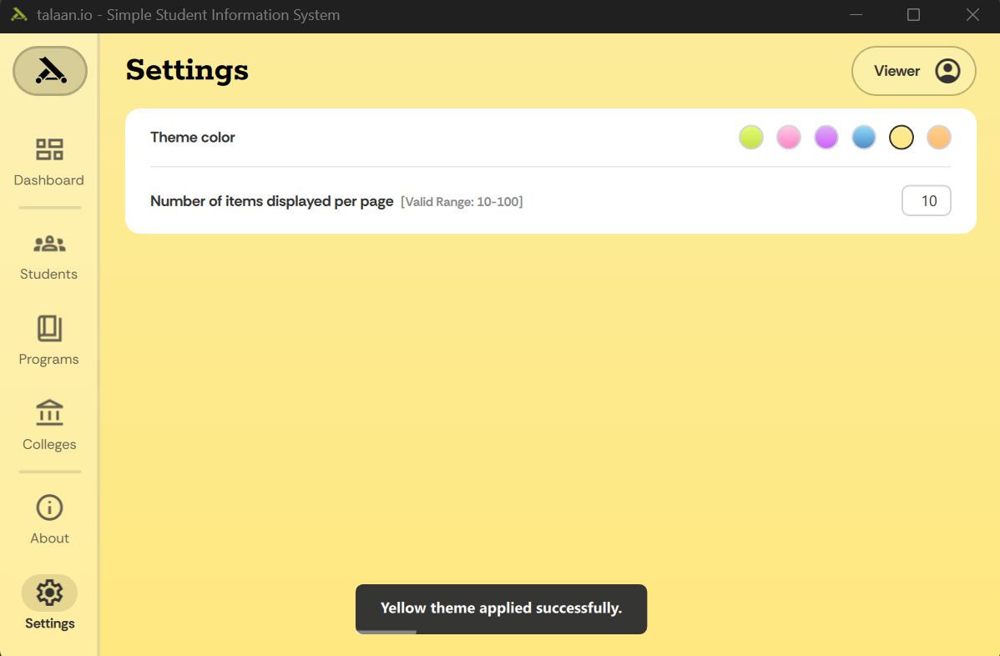

## **talaan.io** - Simple Student Information System (V2)


**talaan.io** is a desktop-based Simple Student Information System (SSIS) designed to streamline academic record management. Built using Python and PyQt6, this project uses SQL as a primary database for full CRUDL functionality.

This project is developed in fulfillment of the requirements for the subject **CCC151 - Information Management**.







## ✨ Features
* Create, read, update, delete, and list (CRUDL) operations for all three directories (students, programs, and colleges)
* Data storage using MySQL
* Window is resizable and allowed to be in full screen mode
* Search operations by field
* Sort operations by field and order by clicking sections of the table header
* Pagination control for large records
* Admin and viewer mode. Admin is able to view and modify all directories, whereas the viewer can only view them.
* Dashboard page that contains demographics
* About page
* Settings page that provides personalized colored themes
* Batch operations (batch edit, batch delete)

## 🧰 Tech Stack

| Technology | Role |
|---|---|
| [Python 3](https://www.python.org/) | Core application language |
| [PyQt6](https://pypi.org/project/PyQt6/) | Desktop GUI framework |
| [QML](https://doc.qt.io/qt-6/qtqml-index.html) | Desktop GUI framework |
| [MySQL](https://www.mysql.com/) | Relational database management system |
| [Faker](https://faker.readthedocs.io/en/master/) | Mock data generator for student records |

## 🚀 Getting Started

### ⚙️ Installation

You have two options to run the project.

#### **Option 1: Binary Distribution**
TODO

#### **Option 2: Setup from Source**
**1. Clone the Repository**
```sh
git clone https://github.com/cooky922/talaan.io-v2.git
cd talaan.io-v2
```
**2. Create and Activate a Virtual Environment**
```sh
python -m venv talaan_env
```

**3. Activate the Virtual Environment**

- **Windows Command Prompt:**
```sh
talaan_env\Scripts\activate
```

- **Windows Powershell:**
```sh
.\talaan_env\Scripts\Activate
```

- **Linux/macOS:**
```sh
source talaan_env/bin/activate
```

**4. Install Dependencies**
```sh
pip install -e .
```
Once the dependencies are installed, create an `.env` file for your database credentials.
Inside the `.env` file, input your database credentials like the example given by `.env.example`.

**5. Running the Project**
Ensure the virtual environment is activated and all dependencies were installed properly
```sh
python main.py
```

#### **Deactivating the Virtual Environment**

You can deactivate the virtual environment once you are done working
```sh
deactivate
```

#### **Troubleshooting**

If `pip install -e .` fails, try manually installing dependencies using:
```sh
pip install -r requirements.txt
```

If `pip install -r requirements.txt` fails, try updating `pip`:
```sh
pip install --upgrade pip
````